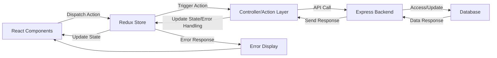
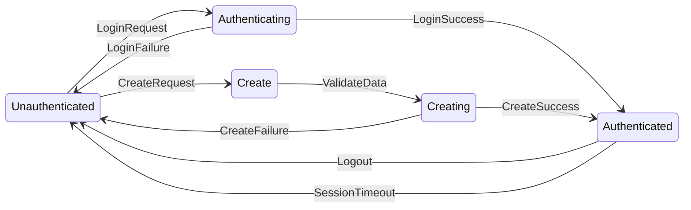
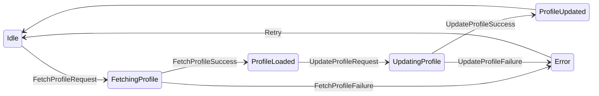
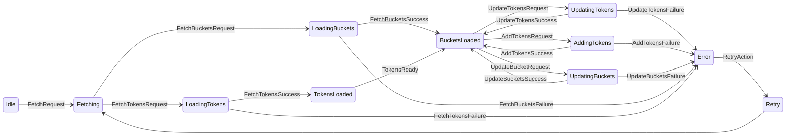
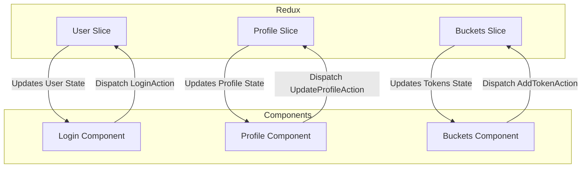
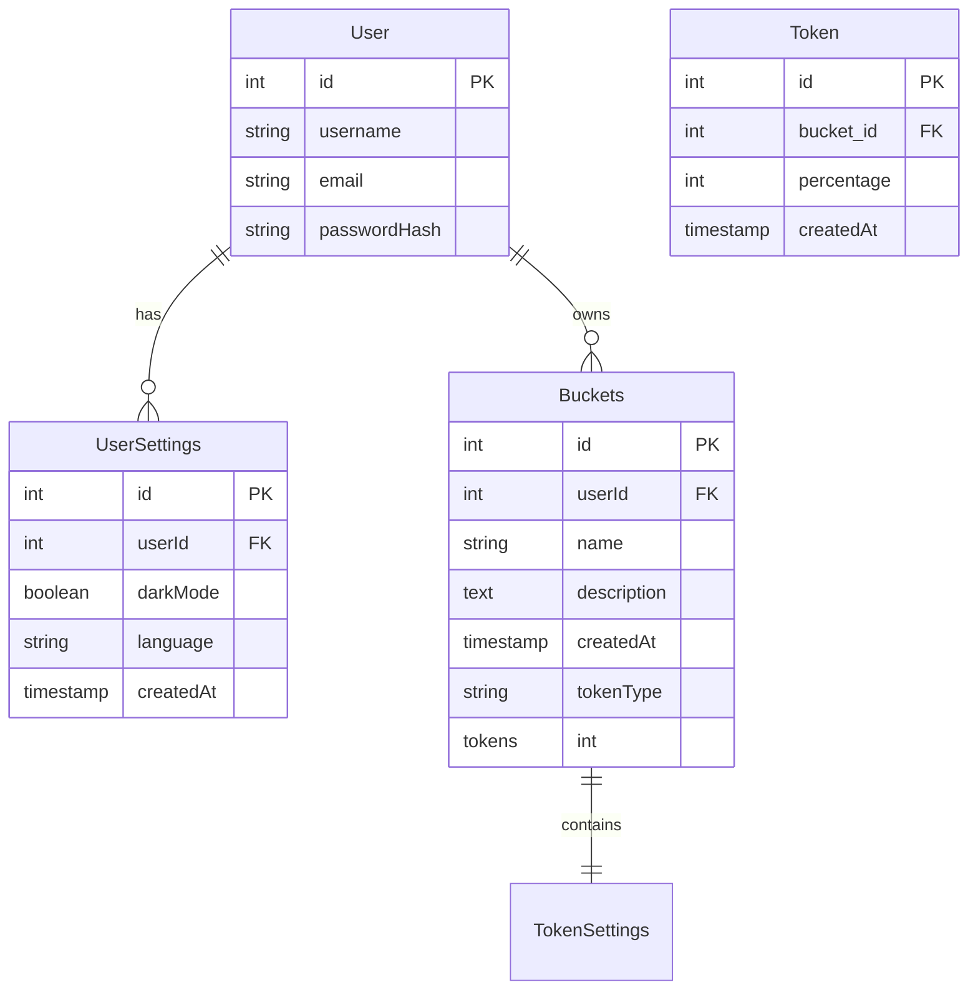

# Daily Tokens Project

# Project Overview 
Create a web app that allows tracking of progress on daily goals 

# Learning Goals
### System Design
- Use Mermaid to create system design docs 
### UI Design
- Use Figma
### Technologies
- Redux 
- Supabase/Postgres
- Auth0 Integration for user management 
### Concepts
- Designing user flow and state transitions
- Separation of concerns (e.g., controllers, components, Redux store)
- Debugging, error handling, and testing

# System Design 
## User Flow diagrams
- Rectangles -> actions
- Circles -> states
- Decisions -> Diamonds
### User Login
Outlining the user login flow, with third party authorization included
  ```mermaid
  flowchart LR
      A([Landing Page])
      A2{Login or Create Account?}
      B["Login
      - Third Party
      - Existing Account"]
      C([Home Page])
      D[Log out]
      E[Create new account with email]
      F([Confirmation page])
      A --> A2
      A2 --> B
      B --> C
      C --> D
      A2 --> E
      E --> F
      F --> C
      D --> A
   ```
### Token Management
Outlining how the user creates buckets, defines token types, adds tokens and view their progress in their activities
  ```mermaid
  flowchart LR
      A([Home Page])
      B[View Summary]
      C[Add Tokens]
      D[View Bucket Details]
      E[Add Bucket]
      F(["Summary of all buckets
          - By Label
          - By hours"])
      G([Modal for token breakdown + details])
      H([Weekly, Monthly, Overall progress])
      I([Bucket Settings])
      J{Save/Cancel}
      K(["Bucket
          - Description
          - Labels
          - Color/Background
          - Week/Month toggle"])
      L(["Token
          - Color/Background
          - Shape
          - Type (Session/time)
          - Session type details
          - Allowed breakdowns by %"])
      A --> B
      A --> C
      A --> D
      A --> E
      B --> F
      C --> G
      D --> H
      H --> I
      E --> I
      I --> K & L --> J --> A
  ```
## Data Flow diagrams 
### Login Flow
Outline login data flow between frontend redux store, express backend, and backend database
  ```mermaid
  flowchart LR
      A([Frontend Redux Store])
      B([Auth0 Server])
      C([Express Backend])
      D[(Database)]
      E{"Login | Create New Account"}
      H[Authenticate account]
      I[User info]
      J[Update user settings, profile, auth state]
      K[Store JWT token in frontend]
      L[Validate JWT in backend]

      A --> E
      E -->|Login| B --> H --> C --> L --> J --> D
      E -->|Create Account| B --> H
      C --> I --> A
      D --> J --> C
      B -->|Return JWT on Login| K --> A
  ```
### Token storage flow
Outlines where information regarding buckets and tokens are stored and transmitted between the frontend, backend, and database

## State diagrams
  - How the application state changes based on the user's actions. 
### User Session 

### User Settings

### Bucket/Token

## Component Interaction Diagrams 
Maps how components interact with each other and update the state in Redux

## Entity-Relationship Diagrams
  - Database design documents (types and tables)

